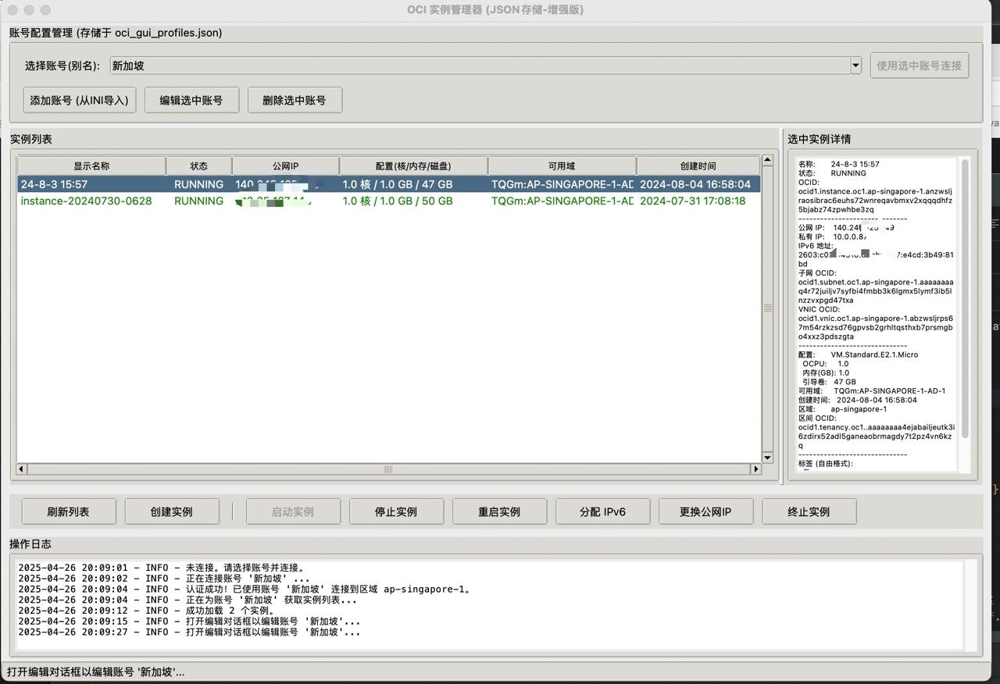

# OCI 实例图形管理器 (OCI Instance Manager GUI)

一个使用 Python 和 Tkinter 编写的、用于管理 Oracle Cloud Infrastructure (OCI) 计算实例的纯本地化简单图形界面工具，支持多账号管理。

## 主要功能

* **多账号管理:** 通过配置文件 (`oci_gui_profiles.json`) 支持管理多个 OCI 账号（使用不同的 API 密钥和配置）。
* **账号导入:** 支持从标准的 OCI `config` 文件导入账号配置。
* **账号编辑:** 可以编辑已保存账号的连接信息和创建实例所需的默认值。
* **实例列表:** 连接账号后，自动刷新并显示当前租户根区间下的实例列表及其关键信息（状态、IP、配置、可用域、创建时间等）。
* **实例操作:**
    * 更换公网 IP (适用于具有公网 IP 的实例)。
    * 重启实例 (Softreset)。
    * 终止实例 (可选择是否保留引导卷)。
* **简化创建实例:**
    * 提供简洁的创建界面，只需选择架构、操作系统、CPU、内存、磁盘大小。
    * 自动根据用户选择查找最新的兼容平台镜像。
    * 自动使用当前账号配置中预设的**默认子网**和**默认 SSH 公钥**。
    * 自动选择区域内的第一个可用域。
    * 实例将自动启用 **root 密码登录** (密码随机生成并仅显示一次)。

## 依赖项

* Python 3.x
* OCI Python SDK: 可以通过 pip 安装 `pip install oci`
* Tkinter: 通常 Python 3 自带，无需额外安装。

## 配置

1.  **OCI API 密钥:** 你需要先在你的 OCI 账户中为你希望使用的用户生成 API 密钥对，并获取必要的 OCID 信息（User OCID, Tenancy OCID, Fingerprint, Region）。请参考 [OCI官方文档：Required Keys and OCIDs](https://docs.oracle.com/en-us/iaas/Content/API/Concepts/apisigningkey.htm) 或其他类似教程项目（https://github.com/cooderl/oci-help-enhanced?tab=readme-ov-file）。
2.  **准备 OCI 配置文件:** 创建一个标准的 OCI `config` 文件（通常位于 `~/.oci/config`），包含你想要导入的账号配置节（例如 `[DEFAULT]`, `[PROFILE1]` 等），并确保 `key_file` 指向正确的私钥文件路径。
3.  **导入账号:**
    * 运行本工具。
    * 点击 "添加账号 (从INI导入)" 按钮。
    * 选择你准备好的 OCI `config` 文件。
    * 在弹出的对话框中，为要导入的每个账号（档案）设置一个**别名 (Alias)**。
    * **非常重要：** 为了使用“创建实例”功能，你**必须**同时输入该账号以后创建实例时要使用的**默认子网 OCID (Default Subnet OCID)** 和**默认 SSH 公钥 (Default SSH Public Key)**。
    * 点击“导入选中档案”。导入的信息将保存在脚本目录下的 `oci_gui_profiles.json` 文件中。
4.  **编辑账号 (补充默认值):**
    * 如果在导入时没有填写默认子网或 SSH 公钥，你可以在主界面选择该账号别名，然后点击 "编辑选中账号" 按钮。
    * 在编辑窗口中，找到 "默认子网 OCID" 和 "默认 SSH 公钥" 字段，填入正确的值并保存。**这是使用“创建实例”功能的必要步骤。**
    * 编辑窗口也允许你修改其他配置信息。

**注意:** `oci_gui_profiles.json` 文件会包含你的 Tenancy、User OCID 及密钥文件路径等信息，请妥善保管。`.gitignore` 文件已配置为忽略此文件，**请勿将其上传到公共仓库**。程序设置（如上次使用的别名）保存在 `oci_gui_settings.json` 中。

## 如何运行

在你的终端中，进入脚本所在的目录，然后执行：

```bash
python oci-instance-manager-gui.py # 或者你实际的脚本文件名

## 基本用法

1.  从下拉框选择一个账号别名。
2.  点击 "使用选中账号连接"。状态栏会显示连接结果。
3.  连接成功后，实例列表会自动刷新（或手动点击 "刷新列表"）。
4.  在列表中选中一个实例，下方的操作按钮（更换IP、重启、终止）会启用。
5.  点击 "创建实例" 按钮，会弹出简化创建窗口。选择配置后点击创建。
    * 如果账号缺少必要的默认子网或SSH公钥，会弹出提示。
6.  创建请求发送成功后，会**弹窗显示生成的 root 密码，请务必立即保存**。
7.  创建需要时间，请稍后手动刷新列表查看新实例状态。

## 注意事项

* **Root 密码登录:** 本工具创建的实例默认开启了 root 用户密码登录，并禁用了原有的 SSH 密钥登录方式 (通过 cloud-init 实现)。这主要是为了方便某些场景，但会**降低服务器的安全性**。请务必使用生成的强密码，并考虑在首次登录后采取额外的安全措施（如修改密码、配置防火墙、重新启用密钥登录等）。
* **资源限制:** 创建实例（尤其是免费规格）可能会因为 OCI 的 "Out of host capacity" (资源不足) 而失败，这并非脚本错误，请尝试更换可用域或稍后重试。
* **错误处理:** 脚本包含基本的错误处理，但可能未覆盖所有 OCI API 可能返回的错误，遇到未明确处理的错误时请根据 OCI 文档或错误信息排查。

## 许可证 (License)

本项目采用 MIT 许可证授权。
